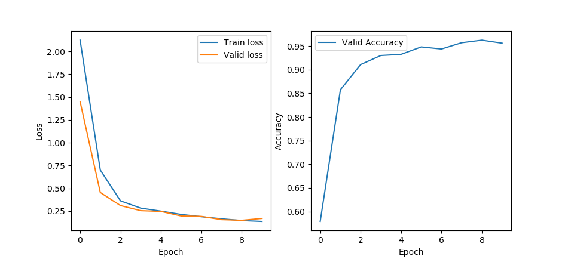
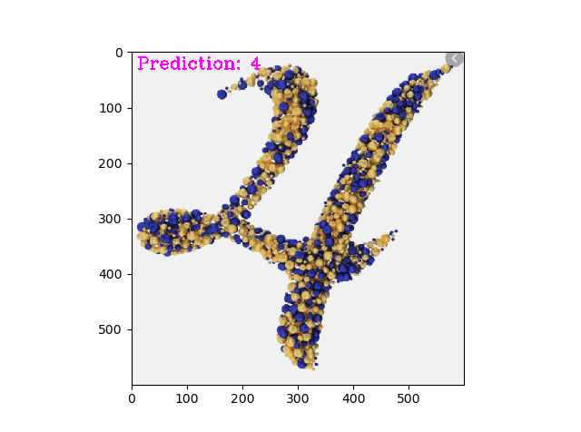

# Digit Classification

The classification project using CNN consists of three phases:

* Processing the data, including data augmentation
* Defining the CNN architecture
* Train and test the model

The CNN architecture was a simple one, combining Convolutional, Pooling 
and Fully-Connected layers. After 20 epochs, which took 1min 30s, 
the final valid accuracy was 98%. After testing the model, every class 
reached more than 98%, except the number 8 which reached 93% 
(eight, you are tough!).
 

An example of what a prediction looks like:

