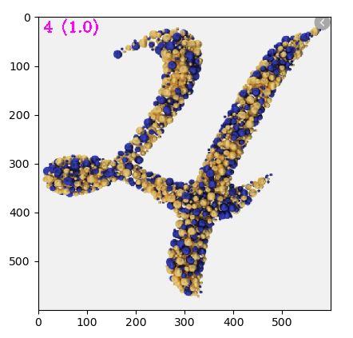

# Digit Classification

This classification project using CNN consists of three phases:

* Processing the data, including data augmentation
* Defining the CNN architecture
* Train and test the model

### Data

The data is a subset of the [Char74K](http://www.ee.surrey.ac.uk/CVSSP/demos/chars74k/), 
which can be downloaded [here](https://drive.google.com/open?id=1cZr91zzHl93H1cbmIwx_7upfQPPMPi33)

### Model

The CNN architecture was a simple one, combining Convolutional, Pooling 
and Fully-Connected layers. After 20 epochs, which took 1min 30s, 
the final valid accuracy was 99%. After testing the model, every class 
reached more than 99%, except the number 8 which reached 96% 
(eight, you are tough!).
 

An example of a prediction:

